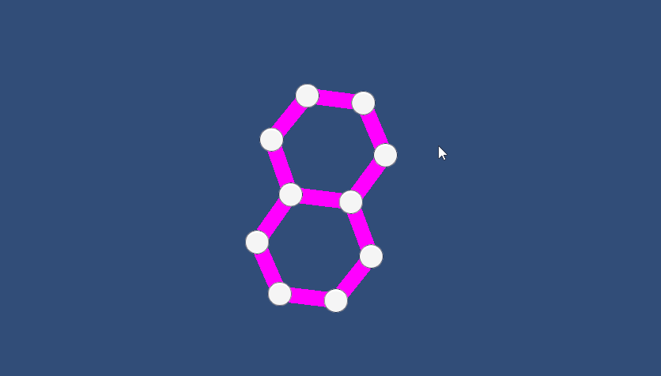

# Editable Graph

## Summary

A simple graph that the user can manipulate. Nodes can be conneted, connections can be cut and nodes can be moved. Nodes will naturally move towards connected nodes and drift away from unconnected nodes.

## To Use

 - Create a gameobject with a Line Renderer (for cutting connections between nodes), and a collider covering the scene for drawing cut lines, and attach the Graph script.
 - Make nodes with colliders and attach Node scripts.
 - Create lines with a line renderers and attach Line scripts. Make prefab of the line and put prefab into Graph object.

 During gameplay, click and drag the left mouse button to either delete lines or to move nodes. Click and drag the right mouse button to create new lines.